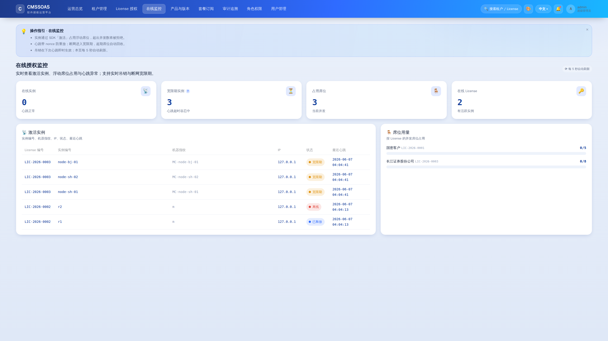
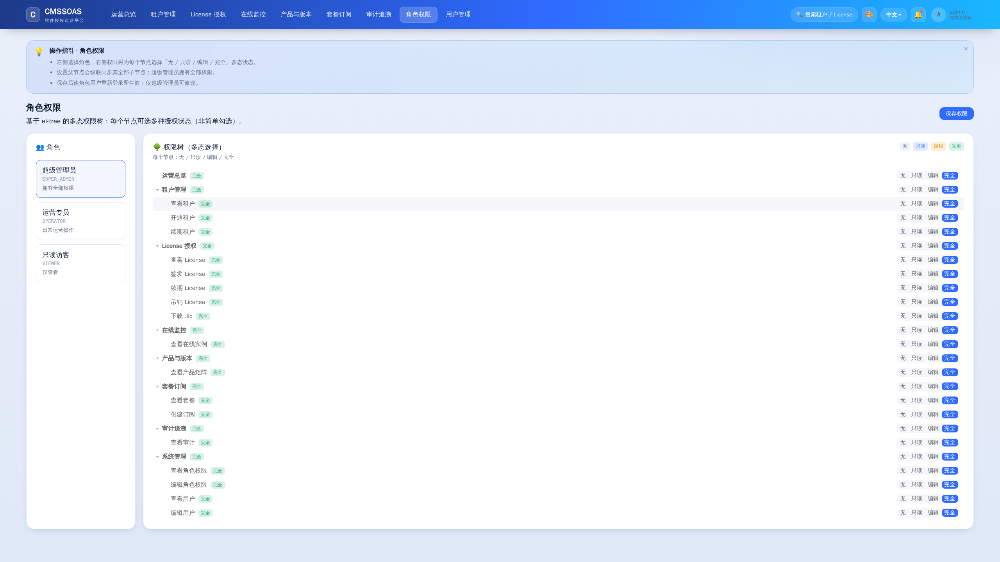
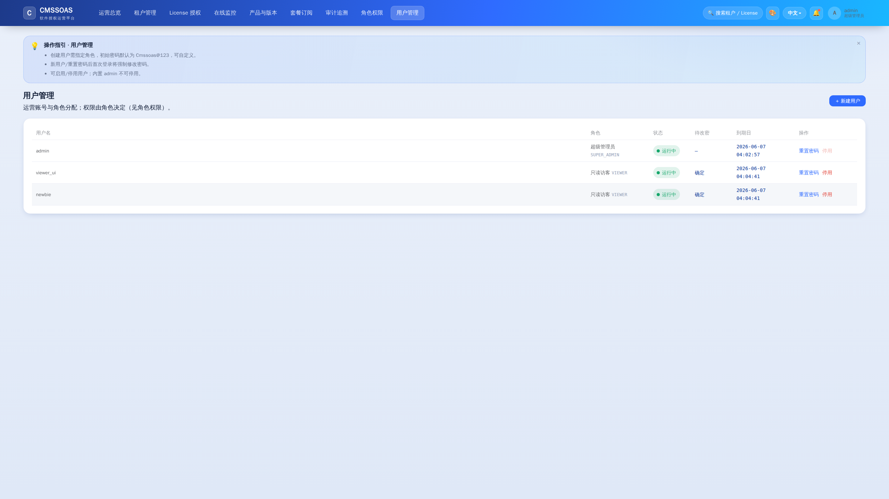
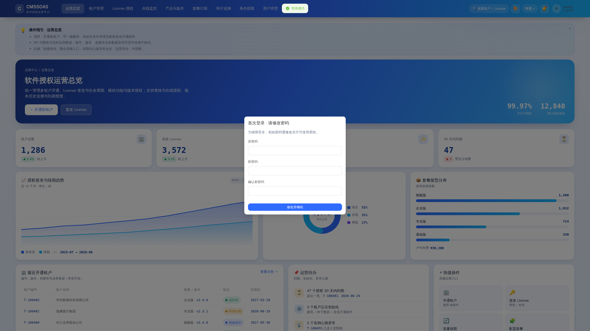
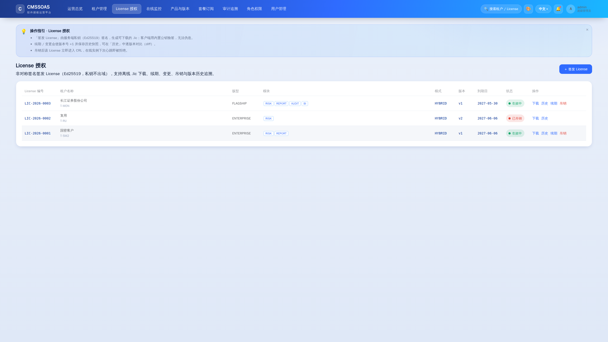
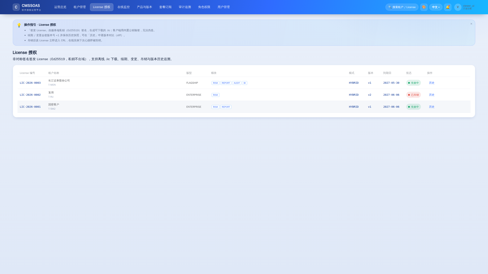
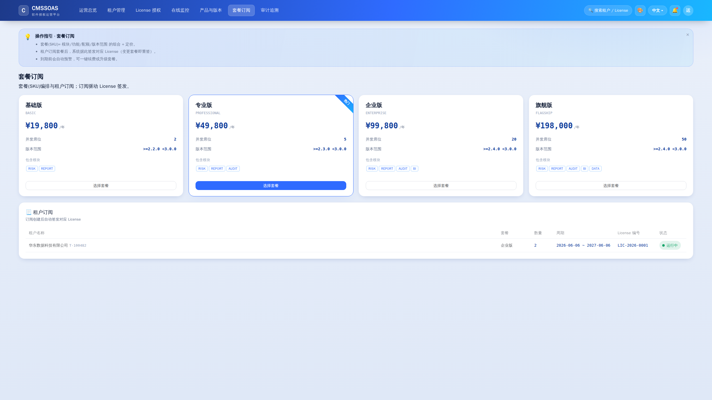
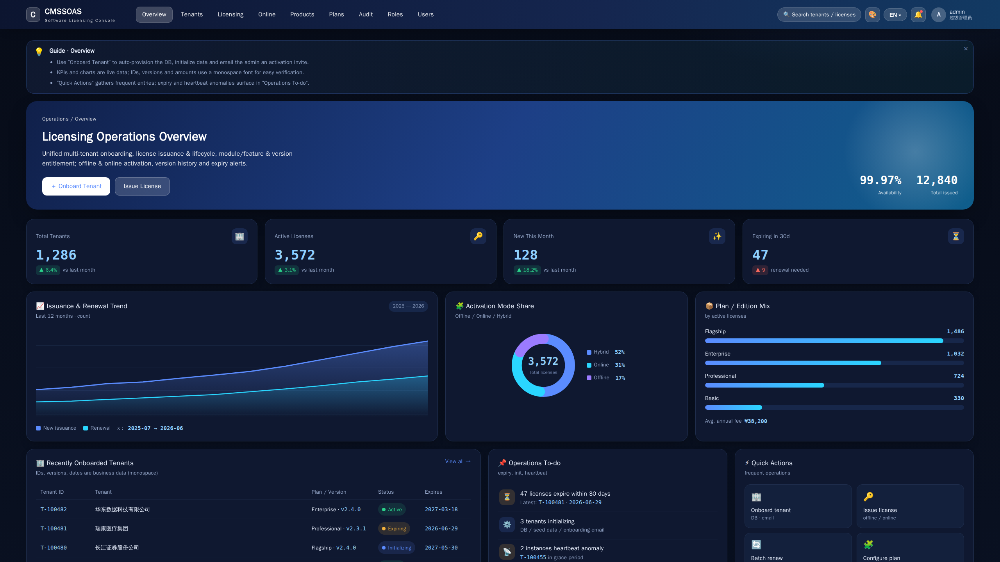

# Cmssoas

[](https://github.com/jameszgw/cmssoas/actions/workflows/ci.yml)


-informational)

**C**ode **M**anagement **S**ecurity **S**ystem · Obfuscation & Authorization Scheme
（Spring Boot 代码保护与 License 认证及多租户运营平台 —— 解决方案）

针对基于 Spring Boot 的 jar 交付物，制定一套覆盖**防逆向代码保护**、**离线/在线 License 认证**、
**多租户可运营授权平台（含前后端）** 的完整解决方案。每一部分均包含设计思路、技术选型对比、潜在风险与应对措施。

## 方案文档（`docs/`）

> 👉 **主文档（推荐先读）**：[00-完整解决方案（分步骤·含前后端）](docs/00-完整解决方案(分步骤·含前后端).md)
> 按 20 个实施步骤推进，**每步统一含【设计思路 / 技术选型对比 / 潜在风险 / 应对措施】并标注前端/后端落点**。
> 下列 01–07 为各专题的细节附录。

| 文档 | 内容 |
|------|------|
| [00-完整解决方案（分步骤·含前后端）](docs/00-完整解决方案(分步骤·含前后端).md) | **主文档**：20 步骤，每步四要素 + 前后端落点 |
| [01-总体方案与架构](docs/01-总体方案与架构.md) | 目标、总体架构、组件职责、端到端流程、技术栈总表、风险总览 |
| [02-代码保护方案](docs/02-代码保护方案.md) | 纵深防御分层、混淆/加密/Native 选型对比、与 License 联动解密、反调试/反 dump、风险与应对 |
| [03-License认证方案](docs/03-License认证方案.md) | 签名算法选型、License 模型、离线/在线流程、防时间回拨/防共享、生命周期与版本/历史追溯、SDK 设计 |
| [04-多租户运营平台](docs/04-多租户运营平台.md) | 隔离策略选型、租户开通与 DB 初始化、超管下发、产品-模块-功能-版本授权模型、ER、前后端架构 |
| [05-安全密钥与部署](docs/05-安全密钥与部署.md) | KMS/HSM 密钥管理、密钥分级轮换、通道安全、部署拓扑与高可用 |
| [06-实施路线图与风险总览](docs/06-实施路线图与风险总览.md) | 分阶段实施路线图、全局风险矩阵、验收指标、现实边界声明 |
| [07-小厂离线授权现实方案](docs/07-小厂离线授权现实方案.md) | 硬件指纹为何对小厂不现实；签名期限/软节点锁/在线自助激活/现成方案等低成本替代 |

## 三大子系统一览

1. **代码保护**：ProGuard/Allatori 混淆 + Xjar/ClassFinal 加密套壳 + 关键逻辑 JNI/GraalVM 原生化 + 反调试/反 dump，且**解密密钥依赖合法 License 派生**。
2. **License 认证**：Ed25519/SM2 非对称签名（私钥不出域）；离线（指纹绑定 .lic）+ 在线（心跳/吊销/浮动席位/宽限期）；完整生命周期、版本号与历史追溯。
3. **多租户平台**：租户一键开通、Flyway 初始化 DB 与种子数据、超管安全下发；"产品—模块—功能—版本"授权模型驱动签发；Vue3 运营控制台 + Spring Boot 后端。

> ⚠️ 现实边界：纯软件保护无法做到绝对不可破解，本方案目标是**抬高破解成本至超过软件价值**，并以"技术 + 运营吊销/溯源 + 法律协议"构建综合防线。

## 可运行实现（已落地并自测）

除方案文档外，本仓库附带**可运行的参考实现**，全链路已端到端自测（见 [自测报告](docs/自测报告.md) / [Self-Test Report (EN)](docs/self-test-report-en.md)）。

| 模块 | 路径 | 说明 |
|------|------|------|
| 运营后端 | `server/license-platform` | Spring Boot：开通/激活/MFA、License 签发与生命周期、在线授权、产品/套餐/订阅、RBAC、审计、可观测 |
| 运营前端 | `web/console` | Vue3 + TS + Element Plus：换肤/2K-4K/中英 i18n/操作帮助 |
| 客户端 SDK | `sdk/license-sdk` | Ed25519 / 国密 SM2 验签 + 功能/版本门禁 |
| 代码保护示例 | `examples/protected-app` | 类加密 + 解密密钥与 License 绑定 + ProGuard 混淆 |
| 部署/可观测 | `docker-compose.yml`、`infra/` | PostgreSQL + Redis + Prometheus + Grafana |

```bash
# 后端（默认 H2，开箱即跑；国密模式加 LICENSE_SIGN_ALGO=sm2）
cd server/license-platform && mvn spring-boot:run        # http://localhost:8080
# 前端（初始账号 admin / 8888）
cd web/console && npm install && npm run dev             # http://localhost:5173
```

## 界面预览

| 在线授权监控 | 角色权限（el-tree 多态选择） |
|---|---|
|  |  |

| 用户管理 | 首次登录强制改密 |
|---|---|
|  |  |

| License（超管：全操作按钮） | License（只读角色：签发/吊销按钮隐藏） |
|---|---|
|  |  |

| 套餐订阅（订阅自动签发 License） | 总览（暗夜主题 + 英文 i18n） |
|---|---|
|  |  |
