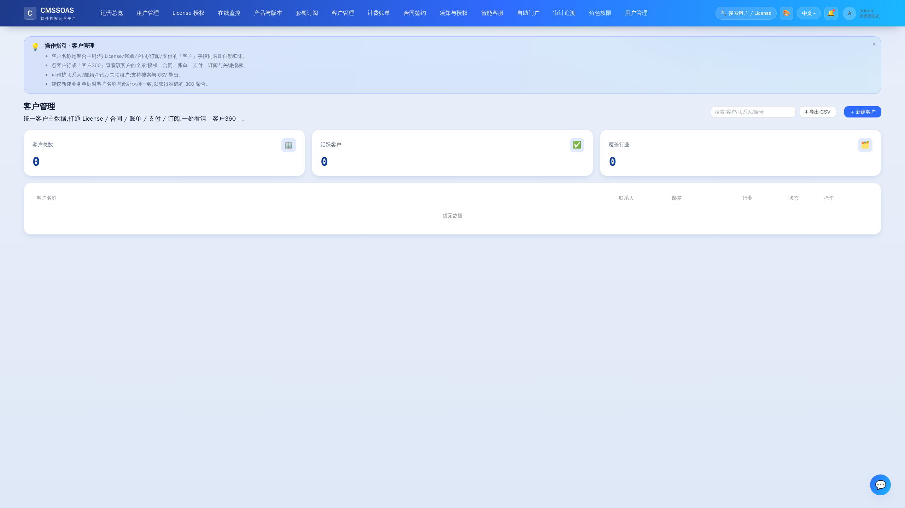
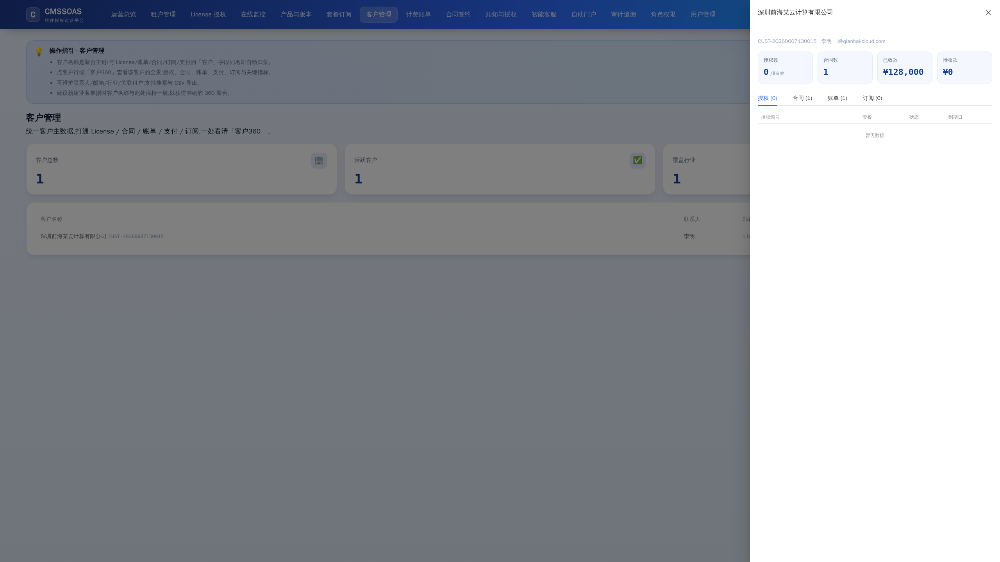
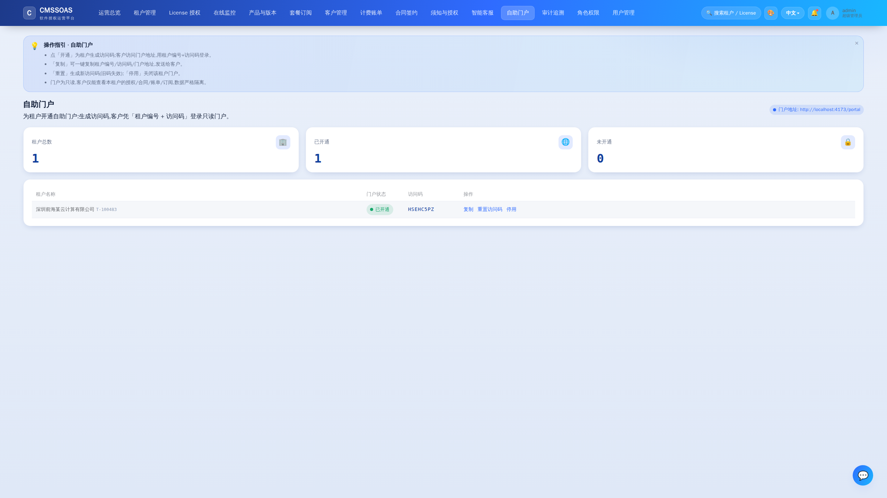
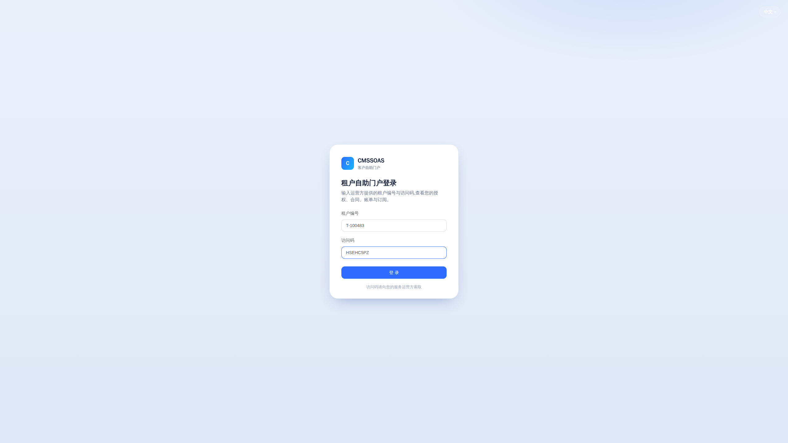
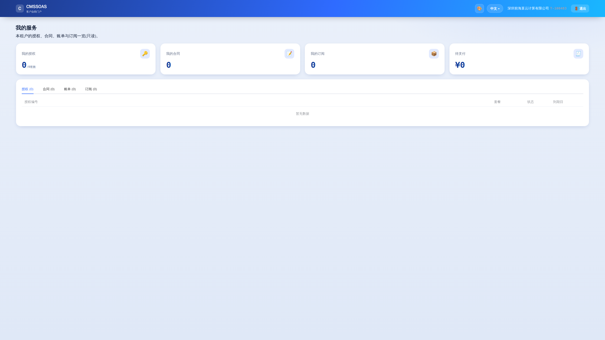
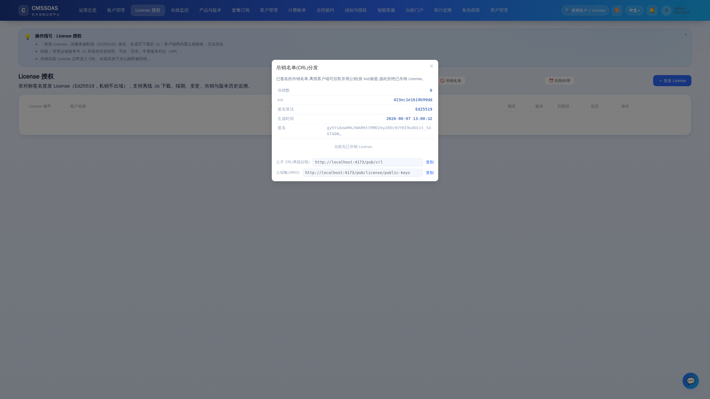

# 功能说明：客户主数据 / 自助门户 / 电子发票 / License 续费吊销闭环

本批补齐四项核心业务能力,沿用平台一贯设计(统一鉴权/审计、provider-agnostic 默认沙箱、多租户隔离、
页面级浅色功能简介 + PageHelp、中英 i18n、CSV 导出)。迁移 V15–V17。

---

## ② 统一客户主数据 + 客户360
- 数据:`customer`(code/name/contact/email/phone/industry/status/tenant_code)。
- 客户360:以**客户名称**聚合 License/合同/账单/支付/订阅(各实体 customer 字段),输出全景与 KPI
  (授权数/有效、合同数、已收款、待收款、订阅数等)——打通原先散落的客户视角。
- 接口:`/api/customers` CRUD、`/{id}/overview`、`export.csv`。权限 `customer:view|edit`。
- 前端:客户列表/搜索/新建编辑 + 客户360 抽屉(KPI + 授权/合同/账单/订阅多 tab)。

## ③ 租户自助门户
- 面向**最终客户**的只读门户,独立于运营后台。
- 运营侧:为租户「开通」生成访问码(`tenant:portal`),可复制(租户编号+访问码+门户地址)/重置/停用。
- 门户侧(公开):`/pub/portal/login`(租户编号 + 访问码)签发**门户专用 JWT**(role=TENANT_PORTAL);
  `/pub/portal/overview` 仅返回**本租户**的 License/合同/账单/订阅 + KPI,严格隔离;token 在控制器内自校验。
- 前端:公开 `Portal` 登录页 + `PortalHome`(独立 token 存储,不与运营后台冲突);运营 `PortalAdmin` 管理页。

## ④ 正规税务发票(电子发票)
- 通用 `EInvoiceProvider` 抽象,默认 `MockEInvoiceProvider`(沙箱生成发票代码/号码/PDF);
  生产改 `app.einvoice.provider` 接航信/百望/税务开放平台,业务层不变。
- 流程:**已收款(PAID)账单** → 申请开票(抬头/税号/普票或专票/邮箱)→ 渠道开具 → 账单置
  **INVOICED**,发票号取**真实发票号码**;专票强制税号。
- 接口:`/api/invoices/{id}/e-invoice`、`/{id}/tax-invoices`、`/tax-invoices/all`。权限 `billing:manage|view`。
- 前端:Billing「开票」升级为电子发票弹层(票种/抬头/税号/邮箱 → 发票代码/号码/PDF)。

## ⑤ License 续费 / 吊销分发闭环
- 续费/变更/吊销已具备;本次补齐**离线分发与到期自动化**:
  - **签名 CRL**:`GET /pub/crl`(公开)返回**已签名**吊销名单
    `{issuedAt,kid,sigAlg,count,revoked[],payloadB64,signature}`;离线 SDK 拉取后用公钥(按 kid)验签,
    据此拒绝已吊销 License。`GET /pub/license/public-keys` 公开公钥集(JWKS 风格)。
  - **到期自动停用**:每日定时(`app.license.auto-expire-interval-ms`)将过期 ACTIVE → EXPIRED 并重签;
    亦可手动 `POST /api/licenses/run-auto-expire`(`license:revoke`)。
  - 在线通道(SDK)已对 REVOKED/EXPIRED 实时拒绝(`OnlineService`)。
- 前端:Licensing 工具条新增「吊销名单」(查看签名 CRL + 公开分发地址 + 复制)与「到期停用」。

---

## 迁移与配置
- `V15__customer.sql` / `V16__tenant_portal.sql` / `V17__tax_invoice.sql`(权限点随启动授予 SUPER_ADMIN)。
- 配置:`app.einvoice.provider`(mock|aisino|baiwang)、`app.license.auto-expire-interval-ms`。

## 测试
全套 24/24 通过,新增:
- `CustomerIntegrationTest`(创建/重名/360 聚合)
- `PortalIntegrationTest`(开通→登录→隔离全景;错码/无token/缺租户防护)
- `TaxInvoiceIntegrationTest`(开具→账单已开票;专票缺税号 400)
- `LicenseLifecycleIntegrationTest`(吊销→**公开签名 CRL 验签通过**;到期自动停用)

## 截图
`web/console/shots/feat-11 ~ feat-16`:客户360、自助门户登录/首页、门户开通管理、电子发票、吊销名单 CRL。

## 界面截图

*客户主数据维护*

*客户360：按客户聚合 License/合同/账单/订阅*

*运营为租户开通自助门户并生成访问码*

*客户用「租户编号 + 访问码」登录门户*

*租户自助门户首页（只读授权视图）*

*签名吊销名单 CRL*
